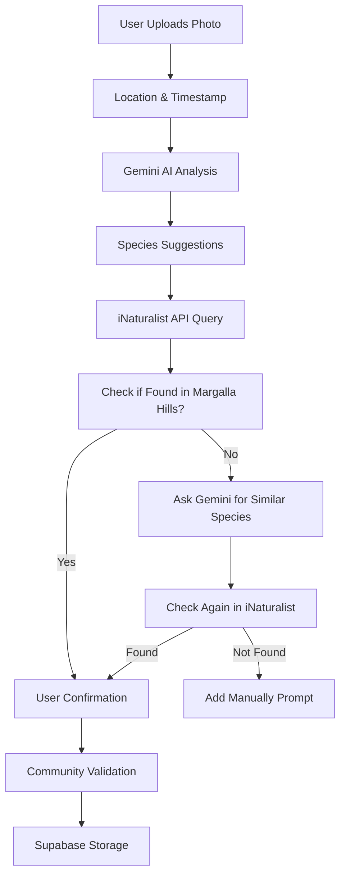

# 🌱 Biodiversity Observation App

## Project Overview
A mobile application that combines AI-powered species identification with community validation to create a comprehensive biodiversity observation platform.

## Tech Stack
- **AI/ML**: Gemini API
- **Data**: iNaturalist API
- **Backend**: Supabase
- **Maps**: Google Maps
- **Frontend**: React JS and tailwind CSS

## Core Features
Core Features
1. Observation Creation
Photo upload/capture functionality

Automatic location detection

Timestamp recording

Data storage in Supabase

2. AI Species Identification
Gemini Vision API integration

Multiple species suggestions

Context-aware analysis

Real-time species suggestions

3. Scientific Validation
iNaturalist API integration

Scientific species information

Taxonomy details

Conservation status

Reference images

Margalla Hills Existence Check

For each Gemini-suggested species, the app queries iNaturalist with user location (e.g., Margalla Hills via lat=33.6844&lng=73.0479).

If the species exists: Display “Found in Margalla Hills”

If not:

Show message: “Not found. Try similar?”

Trigger fallback: Gemini suggests similar species that might exist in that region

If fallback found in iNaturalist: Suggest to user

If nothing found: Prompt user “Add manually?”

4. Interactive Map
Google Maps integration

Observation markers

Location-based visualization

Detailed observation popups

5. Community Features (MVP)
Mocked crowd validation

Research Grade status

Simple upvote system

Community engagement


## Data Flow


## MVP Implementation


## Notes
- All community features will be mocked for MVP
- Focus on core functionality first
- Ensure data privacy and security
- Plan for scalability

🧠 Project Concept
Build a mobile app where users can:

Upload a photo of a plant/animal.

Auto-detect species using Gemini API.

Get validated species info via iNaturalist API.

View observations on a Map.

Store all data in Supabase.

Enable crowd validation (mocked for MVP).


Ideal Combo Flow
🧑 User uploads photo

🗺️ App grabs location + date

🧠 Gemini suggests possible species

🔍 You query iNaturalist for each species to get real info

✅ User confirms or modifies

👥 Community votes (mock for now)

📊 Verified = Research Grade


# 📊 Database Schema

## Tables

### Users
```sql
CREATE TABLE users (
    id UUID PRIMARY KEY DEFAULT uuid_generate_v4(),
    username VARCHAR(50) UNIQUE NOT NULL,
    email VARCHAR(255) UNIQUE NOT NULL,
    created_at TIMESTAMP WITH TIME ZONE DEFAULT CURRENT_TIMESTAMP,
    updated_at TIMESTAMP WITH TIME ZONE DEFAULT CURRENT_TIMESTAMP,
    is_researcher BOOLEAN DEFAULT false,
    research_institution VARCHAR(255)
);
```

### Observations
```sql
CREATE TABLE observations (
    id UUID PRIMARY KEY DEFAULT uuid_generate_v4(),
    user_id UUID REFERENCES users(id),
    photo_url TEXT NOT NULL,
    location GEOGRAPHY(POINT, 4326) NOT NULL,
    timestamp TIMESTAMP WITH TIME ZONE NOT NULL,
    created_at TIMESTAMP WITH TIME ZONE DEFAULT CURRENT_TIMESTAMP,
    updated_at TIMESTAMP WITH TIME ZONE DEFAULT CURRENT_TIMESTAMP,
    status VARCHAR(20) DEFAULT 'pending',
    is_research_grade BOOLEAN DEFAULT false,
    validation_score INTEGER DEFAULT 0
);
```

### Species
```sql
CREATE TABLE species (
    id UUID PRIMARY KEY DEFAULT uuid_generate_v4(),
    scientific_name VARCHAR(255) NOT NULL,
    common_name VARCHAR(255),
    taxonomic_rank VARCHAR(50),
    conservation_status VARCHAR(50),
    iNaturalist_id INTEGER UNIQUE,
    created_at TIMESTAMP WITH TIME ZONE DEFAULT CURRENT_TIMESTAMP,
    updated_at TIMESTAMP WITH TIME ZONE DEFAULT CURRENT_TIMESTAMP
);
```

### Observation_Species
```sql
CREATE TABLE observation_species (
    id UUID PRIMARY KEY DEFAULT uuid_generate_v4(),
    observation_id UUID REFERENCES observations(id),
    species_id UUID REFERENCES species(id),
    confidence_score DECIMAL(5,4),
    created_at TIMESTAMP WITH TIME ZONE DEFAULT CURRENT_TIMESTAMP
);
```

### Validation_Votes
```sql
CREATE TABLE validation_votes (
    id UUID PRIMARY KEY DEFAULT uuid_generate_v4(),
    observation_id UUID REFERENCES observations(id),
    user_id UUID REFERENCES users(id),
    vote_type VARCHAR(10) CHECK (vote_type IN ('up', 'down')),
    created_at TIMESTAMP WITH TIME ZONE DEFAULT CURRENT_TIMESTAMP
);
```

## Indexes
```sql
CREATE INDEX idx_observations_location ON observations USING GIST(location);
CREATE INDEX idx_observations_user ON observations(user_id);
CREATE INDEX idx_observation_species ON observation_species(observation_id);
CREATE INDEX idx_validation_votes_observation ON validation_votes(observation_id);
```

# 📁 Optimal Folder Structure

```
biodiversity-app/
├── src/
│   ├── assets/
│   │   ├── images/
│   │   └── icons/
│   ├── components/
│   │   ├── common/
│   │   │   ├── Button.tsx
│   │   │   ├── Input.tsx
│   │   │   └── Text.tsx
│   │   ├── features/
│   │   │   ├── observations/
│   │   │   │   ├── ObservationCard.tsx
│   │   │   │   ├── CreateObservation.tsx
│   │   │   │   └── ObservationList.tsx
│   │   │   ├── species/
│   │   │   │   ├── SpeciesInfo.tsx
│   │   │   │   └── SpeciesList.tsx
│   │   │   └── map/
│   │   │       └── ObservationMap.tsx
│   ├── hooks/
│   │   ├── useAuthentication.ts
│   │   ├── useObservations.ts
│   │   └── useMap.ts
│   ├── lib/
│   │   ├── api/
│   │   │   ├── supabase.ts
│   │   │   ├── gemini.ts
│   │   │   └── iNaturalist.ts
│   │   ├── utils/
│   │   │   ├── dateUtils.ts
│   │   │   └── locationUtils.ts
│   │   └── types/
│   │       ├── index.ts
│   │       └── location.ts
│   ├── navigation/
│   │   ├── AppNavigator.tsx
│   │   └── types.ts
│   ├── screens/
│   │   ├── Home.tsx
│   │   ├── Map.tsx
│   │   ├── Species.tsx
│   │   └── Profile.tsx
│   └── services/
│       ├── auth.ts
│       ├── storage.ts
│       └── notifications.ts
├── tests/
│   ├── components/
│   ├── screens/
│   └── services/
├── config/
│   ├── supabase.config.ts
│   └── map.config.ts
├── public/
│   └── assets/
├── .env
├── package.json
├── tsconfig.json
└── README.md
```

# 📊 Database Schema Notes

1. **Users Table**
   - UUID for scalability and uniqueness
   - Researcher status for scientific validation
   - Timestamps for audit trails

2. **Observations Table**
   - GEOGRAPHY type for location data
   - Timestamp tracking
   - Status system for validation
   - Research grade flag

3. **Species Table**
   - Integration with iNaturalist
   - Taxonomic information
   - Conservation status tracking

4. **Observation_Species Table**
   - Many-to-many relationship
   - Confidence scores from AI
   - Timestamps for tracking

5. **Validation_Votes Table**
   - Simple up/down voting system
   - Prevent duplicate votes
   - Timestamp tracking

# 📁 Folder Structure Notes

1. **src/**
   - Organized by feature and purpose
   - Separation of concerns
   - Easy maintainability

2. **assets/**
   - Clear separation of image types
   - Optimized for loading

3. **components/**
   - Common components for reusability
   - Feature-specific components
   - Clear separation of concerns

4. **lib/**
   - API integrations separated
   - Utility functions organized
   - TypeScript types centralized

5. **navigation/**
   - Clean routing structure
   - Type safety with TypeScript

6. **services/**
   - Core functionality separated
   - Easy to maintain and test

7. **tests/**
   - Unit tests organized by component
   - Integration tests separate
   - Easy to run and maintain